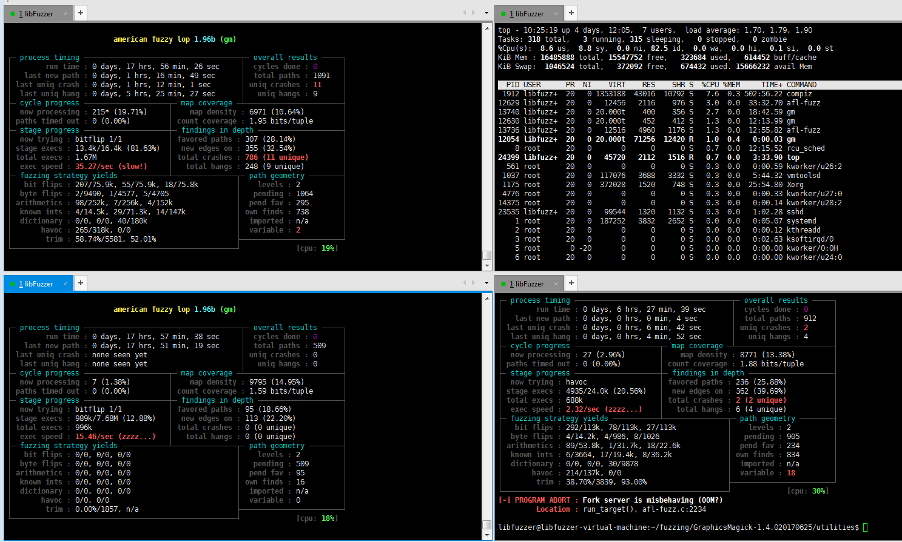
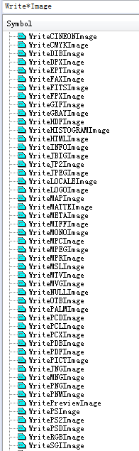
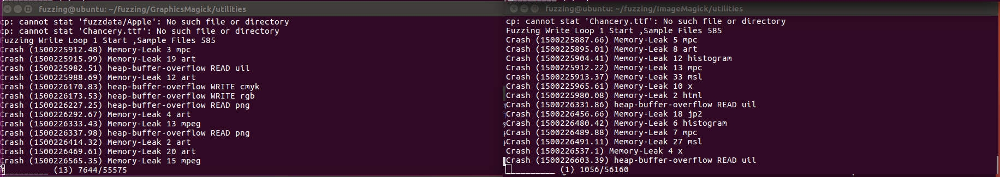
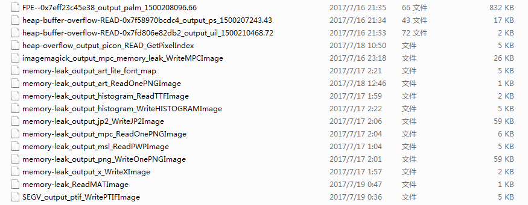
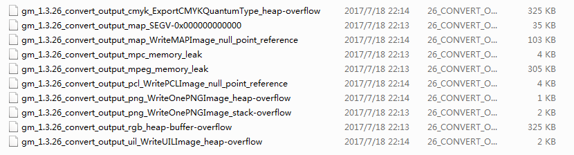

### 1. ImageMagick 图片处理库简介

​	ImageMagick 是一个易于使用和功能强大的图片处理库，很重要的一点是ImageMagick 在比较多的后端应用中出现(比如说:WordPress和Discuz!).挖掘大型CMS 框架的漏洞的难度比较高，那么另一种思路则是通过挖掘CMS 框架使用到的第三方库漏洞让CMS 框架来触发(比如:PHPMailer等第三方库)。由ImageMagick 库引发的CVE-2016-3714 CVE-2016-5118 远程命令执行和两个月前的Yahoo! ImageMagick Heartbleed 已经足以说明从ImageMagick 中触发的漏洞对主机安全性的危害。那么接下来我们来讨论怎么把Fuzzing 技术应用到ImageMagick 的漏洞挖掘上。


### 2. ImageMagick 的使用方式

​	Fuzzing ImageMagick 之前，先来了解ImageMagick 库是怎么样使用的。

​	ImageMagick 在编译完成之后，在`utilities` 目录下会生成`magick`，这就是ImageMagick 图形库的命令行使用工具.`magick` 命令行工具使用如下：

 	 ./magick magick_command other_arguments

​	magick_command 指的是执行命令。有：identify (查看图像信息)，convert (图像处理与格式转换)等，更多命令通过以下链接查询：https://www.imagemagick.org/script/command-line-processing.php

​	other_arguments 指的是命令参数。对于Fuzzing ImageMagick 库，常用的命令是：`./magick convert ` (接下来会慢慢讨论为何要用convert 命令而不用其它命令)。对ImageMagick 做读写测试的命令：`./magick convert input_file.png output.bmp ` 。ImageMagick 库则会读取PNG 格式的图片并且转换成BMP 格式的图像；只对ImageMagick 做读测试的命令：`./magick convert input_file.png /dev/null` ，ImageMagick 库则解析完图片之后就退出了。

​	接下来，我们就开始要对ImageMagick 库进行Fuzzing 了。先从github 上复制最新的代码（建议使用git clone 而不是直接下载源码），命令是：

​	git clone https://github.com/ImageMagick/ImageMagick.git 

​	每次ImageMagick 更新代码,只需要在git pull 即可。

### 3. 如何使用AFL Fuzzing ImageMagick？

​	AFL 在现在是很流行的Fuzzing 测试工具,关于它的介绍在此不多复述.它的使用方法如下:

​	  1.在编译项目时使用afl-clang 或afl-gcc 等AFL 编译器编译。

 	  2.使用afl-fuzz 命令对程序进行fuzz,afl-fuzz 包含以下参数:

​	  afl-fuzz -i %input% -o %output% -t %timeout% -m %memory% fuzz_program fuzz_program_arguments

​	  -i %input% : 使用指定目录下的测试样本。
  	-o %output% : 把Fuzzing 结果保存到指定目录。
​	  -t %timeout% : 可选参数,程序运行超时值,以毫秒为单位。
 	 -m %memory% : 可选参数,最大运行内存,以MB 为单位。
​	 fuzz_program fuzz_program_arguments : 指定fuzzing 程序和程序运行参数。

​	对Ubuntu 用户来说,AFL 可以从apt 中直接安装（sudo apt install afl）。或者从AFL 的官网上下载源码,然后make install.关于Fuzzing 的样本下载,MozillaSecurity 团队有一份开源的测试样本 https://github.com/MozillaSecurity/fuzzdata

​	回到ImageMagick 库Fuzzing ,第一步先使用AFL 编译器编译:

  ```
    cd ImageMagick

    ./configure CC="afl-clang" CXX="afl-clang++"

    make
  ```

​	编译完成之后,接下来使用AFL 对ImageMagick 库进行Fuzzing :<br/>

  ```
    cd utilities

    mkdir fuzzing_output

    afl-fuzz -i ../../fuzzdata/samples/png -o fuzzing_output -t 300000 -m 200 ./magick convert @@ /dev/null
  ```

​	这句afl-fuzz 命令行的意思是:使用fuzzdata 中的PNG 测试样本作为输入,把Fuzzing 的结果保存到fuzzing_output 目录中.afl-fuzz 程序运行30 秒超时值是为了让ImageMagick 有更多的时间来执行代码,很有可能Fuzzing 到一些执行很久循环代码,被afl-fuzz 当作超时样本来记录,但这些样本并不是Out-of-Memory 或者CPU exhaustion 类的漏洞.最后利用ImageMagick 的convert 命令来测试ImageMagick 的读操作。

​	下面是Fuzzing 的情况,在AFL fuzzing 里获得了7 个CVE.

  

  	跑AFL 一定需要注意样本,好的样本能够大大提升Fuzzing 效率。

​	*参考链接:http://lcamtuf.coredump.cx/afl/


### 4. AddressSanitizer (ASAN)与崩溃调试

​	跑到新的崩溃文件时,往往需要进一步定位崩溃点.笔者推荐使用AddressSanitizer ,它是非常强大的内存检测工具,它能够检测不同的内存漏洞以及内存泄漏(内存泄漏也算CVE ,具体请到CVE 官往搜索ImageMagick 的漏洞).我们需要在编译的时候引入ASAN：

  ```
    cd ImageMagick

    ./configure CC="gcc" CXX="g++" CFLAGS="-g -fsanitize=address"

    make
  ```

​	在CFLAGS 参数里:-g 指编译的时候添加符号信息,-fsanitize=address 则是让编译器在编译时添加ASAN .然后在`utilities` 下生成的`./magick` 程序就带有ASAN 了.运行一个崩溃样本,输出如下:

  ```
    fuzzing@ubuntu:~/fuzzing/ImageMagick/utilities$ ./magick convert all_fuzzing_format_2017_7_16_5_13_10/crash/heap-buffer-overflow-READ-0x7f58970bcdc4_output_ps_1500207243.43 output.ps
    ==61378==ERROR: AddressSanitizer: heap-buffer-overflow on address 0x7f06a32fedcc at pc 0x7f06aec0f9c2 bp 0x7ffcb67d5a30 sp 0x7ffcb67d5a20
    READ of size 4 at 0x7f06a32fedcc thread T0
    #0 0x7f06aec0f9c1 in GetPixelAlpha MagickCore/pixel-accessor.h:59
    #1 0x7f06aec17ff8 in WritePSImage coders/ps.c:2046
    #2 0x7f06ae7491c6 in WriteImage MagickCore/constitute.c:1114
    #3 0x7f06ae749e42 in WriteImages MagickCore/constitute.c:1333
    #4 0x7f06adf9c3eb in ConvertImageCommand MagickWand/convert.c:3280
    #5 0x7f06ae094d98 in MagickCommandGenesis MagickWand/mogrify.c:183
    #6 0x4017f1 in MagickMain utilities/magick.c:149
    #7 0x4019d2 in main utilities/magick.c:180
    #8 0x7f06ad80982f in __libc_start_main (/lib/x86_64-linux-gnu/libc.so.6+0x2082f)
    #9 0x401308 in _start (/home/fuzzing/fuzzing/ImageMagick/utilities/.libs/lt-magick+0x401308)

    0x7f06a32fedcc is located 12 bytes to the right of 556480-byte region [0x7f06a3277000,0x7f06a32fedc0)
    allocated by thread T0 here:
    #0 0x7f06af3e5076 in __interceptor_posix_memalign (/usr/lib/x86_64-linux-gnu/libasan.so.2+0x99076)
    #1 0x7f06ae8ed8de in AcquireAlignedMemory MagickCore/memory.c:262
    #2 0x7f06ae6e4731 in OpenPixelCache MagickCore/cache.c:3523
    #3 0x7f06ae6dd0d1 in GetImagePixelCache MagickCore/cache.c:1667
    #4 0x7f06ae6ec1f0 in SyncImagePixelCache MagickCore/cache.c:5222
    #5 0x7f06ae8b9609 in SetImageExtent MagickCore/image.c:2554
    #6 0x7f06aec53c99 in ReadSGIImage coders/sgi.c:374
    #7 0x7f06ae746068 in ReadImage MagickCore/constitute.c:497
    #8 0x7f06ae748267 in ReadImages MagickCore/constitute.c:866
    #9 0x7f06adf060ad in ConvertImageCommand MagickWand/convert.c:641
    #10 0x7f06ae094d98 in MagickCommandGenesis MagickWand/mogrify.c:183
    #11 0x4017f1 in MagickMain utilities/magick.c:149
    #12 0x4019d2 in main utilities/magick.c:180
    #13 0x7f06ad80982f in __libc_start_main (/lib/x86_64-linux-gnu/libc.so.6+0x2082f)

    SUMMARY: AddressSanitizer: heap-buffer-overflow MagickCore/pixel-accessor.h:59 GetPixelAlpha
    Shadow bytes around the buggy address:
    0x0fe154657d60: 00 00 00 00 00 00 00 00 00 00 00 00 00 00 00 00
    0x0fe154657d70: 00 00 00 00 00 00 00 00 00 00 00 00 00 00 00 00
    0x0fe154657d80: 00 00 00 00 00 00 00 00 00 00 00 00 00 00 00 00
    0x0fe154657d90: 00 00 00 00 00 00 00 00 00 00 00 00 00 00 00 00
    0x0fe154657da0: 00 00 00 00 00 00 00 00 00 00 00 00 00 00 00 00
    =>0x0fe154657db0: 00 00 00 00 00 00 00 00 fa[fa]fa fa fa fa fa fa
    0x0fe154657dc0: fa fa fa fa fa fa fa fa fa fa fa fa fa fa fa fa
    0x0fe154657dd0: fa fa fa fa fa fa fa fa fa fa fa fa fa fa fa fa
    0x0fe154657de0: fa fa fa fa fa fa fa fa fa fa fa fa fa fa fa fa
    0x0fe154657df0: fa fa fa fa fa fa fa fa fa fa fa fa fa fa fa fa
    0x0fe154657e00: fa fa fa fa fa fa fa fa fa fa fa fa fa fa fa fa
    Shadow byte legend (one shadow byte represents 8 application bytes):
    Addressable: 00
    Partially addressable: 01 02 03 04 05 06 07
    Heap left redzone: fa
    Heap right redzone: fb
    Freed heap region: fd
    Stack left redzone: f1
    Stack mid redzone: f2
    Stack right redzone: f3
    Stack partial redzone: f4
    Stack after return: f5
    Stack use after scope: f8
    Global redzone: f9
    Global init order: f6
    Poisoned by user: f7
    Container overflow: fc
    Array cookie: ac
    Intra object redzone: bb
    ASan internal: fe
    ==61378==ABORTING
  ```

​	ASAN 同样也能用在漏洞挖掘上(比如Heap-overflow READ ,这样的漏洞不容易触发崩溃(除非读到不能够访问的内存上,否则是不会产生崩溃的)).但是在AFL 里,不可以在./configure 时把-fsanitize=address 直接添加在CFLAGS 里面,而是需要在make 的时候这样写：

  ```
    AFL_USE_ASAN=1 make
  ```

​	把ASAN 作为异常捕获的,还有libFuzzer。


### 5. 如何使用libFuzzer Fuzzing ImageMagick？

​	libFuzzer 与AFL 的区别在于：libFuzzer 倾向于对某个功能或者函数来进行Fuzzing，AFL 则是对整体程序进行Fuzzing。下面是一段使用libFuzzer Fuzzing C-ares DNS 库的示例代码(CVE-2017-1000381)：

  ```
    #include <malloc.h>
    #include <ares.h>

    extern "C" int LLVMFuzzerTestOneInput(const unsigned char* data,size_t size) {
        ares_naptr_reply* naptr_out = 0;

        ares_parse_naptr_reply(data,size,&naptr_out);

        if (0 != naptr_out)
            free(naptr_out);

    }
  ```

​	LLVMFuzzerTestOneInput() 函数是libFuzzer 库进行单元测试的调用点,这里面的实现就是我们将要编写的测试用例.libFuzzer 能够更深入去挖掘潜在的漏洞,但是需要对源码有一定的了解.以ImageMagick 为例,convert 命令中的图片最后会被ReadImage() 调用去解析,ReadImage() 函数会根据目录去打开文件再从中读取数据来给指定的格式来解析.下面是针对ImageMagick 的图片解析Fuzzing 代码：

  ```
    #include <malloc.h>
    #include <memory.h>
    #include <stdio.h>
    #include <stdlib.h>

    #define MAGICK_IMPLEMENTATION
    #define MagickExport

    #include "magick/common.h"
    #include "magick/image.h"
    #include "magick/error.h"
    #include "magick/constitute.h"
    #include "magick/magick_types.h"
    #include "magick/utility.h"
    #include "magick/magick.h"


    static const struct {
      char
        *name;

      unsigned char
        *magic;

      unsigned int
        length,
        offset;
    } StaticMagic[] = {
    #define MAGIC(name,offset,magic) {name,(unsigned char *)magic,sizeof(magic)-1,offset}
      MAGIC("WEBP", 8, "WEBP"),
      MAGIC("AVI", 0, "RIFF"),
      MAGIC("8BIMWTEXT", 0, "8\000B\000I\000M\000#"),
      MAGIC("8BIMTEXT", 0, "8BIM#"),
      MAGIC("8BIM", 0, "8BIM"),
      MAGIC("BMP", 0, "BA"),
      MAGIC("BMP", 0, "BM"),
      MAGIC("BMP", 0, "CI"),
      MAGIC("BMP", 0, "CP"),
      MAGIC("BMP", 0, "IC"),
      MAGIC("BMP", 0, "PI"),
      MAGIC("CALS", 21, "version: MIL-STD-1840"),
      MAGIC("CALS", 0, "srcdocid:"),
      MAGIC("CALS", 9, "srcdocid:"),
      MAGIC("CALS", 8, "rorient:"),
      MAGIC("CGM", 0, "BEGMF"),
      MAGIC("CIN", 0, "\200\052\137\327"),
      MAGIC("DCM", 128, "DICM"),
      MAGIC("DCX", 0, "\261\150\336\72"),
      MAGIC("DIB", 0, "\050\000"),
      MAGIC("DOT", 0, "digraph"),
      MAGIC("DPX", 0, "SDPX"),
      MAGIC("DPX", 0, "XPDS"),
      MAGIC("EMF", 40, "\040\105\115\106\000\000\001\000"),
      MAGIC("EPT", 0, "\305\320\323\306"),
      MAGIC("FAX", 0, "DFAX"),
      MAGIC("FIG", 0, "#FIG"),
      MAGIC("FITS", 0, "IT0"),
      MAGIC("FITS", 0, "SIMPLE"),
      MAGIC("FPX", 0, "\320\317\021\340"),
      MAGIC("GIF", 0, "GIF8"),
      MAGIC("HDF", 1, "HDF"),
      MAGIC("HPGL", 0, "IN;"),
      MAGIC("HPGL", 0, "\033E\033"),
      MAGIC("HTML", 1, "HTML"),
      MAGIC("HTML", 1, "html"),
      MAGIC("ILBM", 8, "ILBM"),
      MAGIC("IPTCWTEXT", 0, "\062\000#\000\060\000=\000\042\000&\000#\000\060\000;\000&\000#\000\062\000;\000\042\000"),
      MAGIC("IPTCTEXT", 0, "2#0=\042&#0;&#2;\042"),
      MAGIC("IPTC", 0, "\034\002"),
      MAGIC("JNG", 0, "\213JNG\r\n\032\n"),
      MAGIC("JPEG", 0, "\377\330\377"),
      MAGIC("JPC", 0, "\377\117"),
      MAGIC("JP2", 4, "\152\120\040\040\015"),
      MAGIC("MAT", 0, "MATLAB 5.0 MAT-file,"),
      MAGIC("MIFF", 0, "Id=ImageMagick"),
      MAGIC("MIFF", 0, "id=ImageMagick"),
      MAGIC("MNG", 0, "\212MNG\r\n\032\n"),
      MAGIC("MPC", 0, "id=MagickCache"),
      MAGIC("MPEG", 0, "\000\000\001\263"),
      MAGIC("PCD", 2048, "PCD_"),
      MAGIC("PCL", 0, "\033E\033"),
      MAGIC("PCX", 0, "\012\002"),
      MAGIC("PCX", 0, "\012\005"),
      MAGIC("PDB", 60, "vIMGView"),
      MAGIC("PDF", 0, "%PDF-"),
      MAGIC("PFA", 0, "%!PS-AdobeFont-1.0"),
      MAGIC("PFB", 6, "%!PS-AdobeFont-1.0"),
      MAGIC("PGX", 0, "PG ML"),
      MAGIC("PGX", 0, "PG LM"),
      MAGIC("PICT", 522, "\000\021\002\377\014\000"),
      MAGIC("PNG", 0, "\211PNG\r\n\032\n"),
      MAGIC("PBM", 0, "P1"),
      MAGIC("PGM", 0, "P2"),
      MAGIC("PPM", 0, "P3"),
      MAGIC("PBM", 0, "P4"),
      MAGIC("PGM", 0, "P5"),
      MAGIC("PPM", 0, "P6"),
      MAGIC("P7", 0, "P7 332"), /* XV Thumbnail */
      MAGIC("PAM", 0, "P7"), /* Should be listed after "P7 332" */
      MAGIC("PS", 0, "%!"),
      MAGIC("PS", 0, "\004%!"),
      MAGIC("PS", 0, "\305\320\323\306"),
      MAGIC("PSD", 0, "8BPS"),
      MAGIC("PWP", 0, "SFW95"),
      MAGIC("RAD", 0, "#?RADIANCE"),
      MAGIC("RAD", 0, "VIEW= "),
      MAGIC("RLE", 0, "\122\314"),
      MAGIC("SCT", 0, "CT"),
      MAGIC("SFW", 0, "SFW94"),
      MAGIC("SGI", 0, "\001\332"),
      MAGIC("SUN", 0, "\131\246\152\225"),
      MAGIC("SVG", 1, "?XML"),
      MAGIC("SVG", 1, "?xml"),
      MAGIC("TIFF", 0, "\115\115\000\052"),
      MAGIC("TIFF", 0, "\111\111\052\000"),
      MAGIC("BIGTIFF", 0, "\115\115\000\053\000\010\000\000"),
      MAGIC("BIGTIFF", 0, "\111\111\053\000\010\000\000\000"),
      MAGIC("VICAR", 0, "LBLSIZE"),
      MAGIC("VICAR", 0, "NJPL1I"),
      MAGIC("VIFF", 0, "\253\001"),
      MAGIC("WMF", 0, "\327\315\306\232"),
      MAGIC("WMF", 0, "\001\000\011\000"),
      MAGIC("WPG", 0, "\377WPC"),
      MAGIC("XBM", 0, "#define"),
      MAGIC("XCF", 0, "gimp xcf"),
      MAGIC("XPM", 1, "* XPM *"),
      MAGIC("XWD", 4, "\007\000\000"),
      MAGIC("XWD", 5, "\000\000\007")
    };

    int random(const unsigned char* data,unsigned int size) {
        unsigned int random_code = 0;

        for (unsigned int data_index = 0;data_index < size;++data_index)
            random_code += data[data_index];

        return random_code % (sizeof(StaticMagic) /sizeof(StaticMagic[0]));
    }

    #define GENARATE_FILE_NAME "./libFuzzerGenarateImageSample"

    extern "C" int LLVMFuzzerTestOneInput(const unsigned char* data,unsigned int size) {
        int random_image_flag_index = random(data,size);
        unsigned int random_image_flag_offset = StaticMagic[random_image_flag_index].offset;
        unsigned int random_image_flag_length = StaticMagic[random_image_flag_index].length;
        unsigned int image_buffer_length = random_image_flag_offset + random_image_flag_length + size;
        unsigned char* image_buffer = (unsigned char*)malloc(image_buffer_length);

        memset(image_buffer,0,image_buffer_length);
        memcpy(image_buffer,StaticMagic[random_image_flag_index].name,StaticMagic[random_image_flag_index].length);

        FILE* file = fopen(GENARATE_FILE_NAME,"w");

        if (NULL != file) {
            fwrite(image_buffer,1,image_buffer_length,file);
            fclose(file);

            printf("buffer=%s(0x%X), size=%d,input format=%s\n",image_buffer,image_buffer,image_buffer_length,StaticMagic[random_image_flag_index].name);

            ExceptionInfo exception;
            ImageInfo* read_image_info;
            ImageInfo* write_image_info;
            Image*     image;

            GetExceptionInfo(&exception);

            read_image_info = CloneImageInfo((ImageInfo*)NULL);
            write_image_info = CloneImageInfo((ImageInfo*)NULL);

            strlcpy(read_image_info->filename,GENARATE_FILE_NAME,MaxTextExtent);
            strlcpy(write_image_info->filename,"/dev/null",MaxTextExtent);
            SetImageInfo(read_image_info,SETMAGICK_READ,&exception);
            SetImageInfo(write_image_info,SETMAGICK_WRITE,&exception);

            image = ReadImage(read_image_info,&exception);

            if (NULL != image)
                WriteImage(write_image_info,image);

            DestroyImageInfo(read_image_info);
            DestroyImageInfo(write_image_info);
            DestroyExceptionInfo(&exception);
        }

        free(image_buffer);

        return 0;
    }

    extern "C" int LLVMFuzzerInitialize(int *argc, char ***argv) {
        InitializeMagick((const char*)argv[0]);

        return 1;
    }

  ```

 	使用libFuzzer Fuzzing 时,编译时一定要添加ASAN :

  ```
    cd ImageMagick

    ./configure CC="clang" CXX="clang++" CFLAGS="-O2 -g -fsanitize-coverage=trace-pc-guard -fsanitize=address"

    make

    cd utilities

    clang++ read_image_fuzzer.cc -O2 -g -fsanitize-coverage=trace-pc-guard -fsanitize=address -I .. -ljbig -lwebp -llcms2 -ltiff -lfreetype -ljpeg -lpng12 -lwmflite -lXext -lSM -lICE -lX11 -llzma -lbz2 -lxml2 -lz -lm -lgomp -lpthread ../magick/.libs/libMagickCore-7.Q16HDRI.a ../../libFuzzer/Fuzzer/libFuzzer.a -o read_image_fuzzer
  ```

​	第一次编译ImageMagick 时,一定要把ASAN 也编译进去,否则在ImageMagick 库里面跑出来漏洞libFuzzer 不会提示!接下来编译我们的测试Fuzzer ,注意需要这两次编译都要用到clang 5 ,因为插件-fsanitize-coverage=trace-pc-guard 需要在高版本的clang 里才有,否则libFuzzer 会没有数据输入(笔者也是在读libFuzzer 的源码里发现的),后面需要引用的库则根据自己的系统来添加,会有些差异。

​	关于更多libFuzzer 的知识,可以参考这两个链接：

​	1、https://github.com/Dor1s/libfuzzer-workshop

​	2、http://llvm.org/docs/LibFuzzer.html


### 6. 程序模型与代码覆盖

​	程序模型简单地来说可以分为三部分:输入,处理,输出.无论是WEB 还是二进制都一样成立,<b>漏洞会隐藏在这三个阶段的某个角落里</b>.举个例子,输入阶段有:ETERNALBLUE ,S2-045 (上传组件的异常信息中可以执行OGNL 导致GetShell ),CVE-2017-7269—IIS 6.0 WebDAV ;处理阶段:各大SRC 里的业务逻辑漏洞,BadKernel ;输出阶段:XSS 漏洞.Fuzzing 的时候也需要考虑到这点,尽可能让程序所有的阶段都能够执行,达到更高的代码覆盖率

​	在前面AFL 与libFuzzer 的例子里,我们暂时只Fuzzing ImageMagick 读取图片部分(对应到代码的ReadXXXImage() 函数),接下来我们要针对ImageMagick 的写图片部分进行Fuzzing(对应到代码的WriteXXXImage() 函数)


### 7. 使用Python 实现ImageMagick Fuzzer

​	我们自己在实现Fuzzer 的时候,如何准确地检测触发的漏洞点是一个难题,现在已经有ASAN 作为强力的Bug 检测工具,我们只需要针对Fuzzing 的逻辑来编写即可.前面提到,ImageMagick 可以实现不同图像格式之间的转换,所以在Fuzzing 时要触发到WriteXXXImage() 这类函数,必须要以指定的格式来输出.比如说触发WritePNGImage() 函数,magick 就必须要输出.png 格式图像;触发WriteARTImage() 函数,magick 就必须要输出.art 格式图像,命令如下：

  ```
    ./magick convert test_image output.png
    ./magick convert test_image output.art
  ```

  ImageMagick 库支持很多格式的图像转换,更多信息可以在SourceInsight 里搜索Write*Image() 函数：

  

​	最后得到支持输出格式的列表:

  ```
    imagemagick_output_format = ['output.aai','output.art','output.avs','output.bgr','output.bmp','output.braille','output.cals','output.cin','output.cip','output.clipboard','output.cmyk','output.dds','output.debug','output.dib','output.dpx','output.ept','output.exr','output.fax','output.fits','output.flif','output.fpx','output.gif','output.gray','output.histogram','output.hrz','output.html','output.icon','output.info','output.inline','output.ipl','output.jbig','output.jp2','output.jpeg','output.json','output.magick','output.map','output.mask','output.mat','output.matte','output.meta','output.miff','output.mono','output.mpc','output.mpeg','output.mpr','output.msl','output.mtv','output.mvg','output.null','output.otb','output.palm','output.pcd','output.pcl','output.pcx','output.pdb','output.pdf','output.pgx','output.pict','output.jng','output.mng','output.png','output.pnm','output.ps','output.ps2','output.ps3','output.psd','output.raw','output.rgb','output.rgf','output.sgi','output.sixelt','output.sun','output.svg','output.tga','output.thumbnail','output.ptif','output.tiff','output.txt','output.uil','output.uyvy','output.vicar','output.vid','output.viff','output.vips','output.wbmp','output.webp','output.xbm','output.picon','output.xpm','output.xtrn','output.xwd','output.ycbcr','output.ps3mask','output.group4','output.yuv''output.x']
  ```

  然后给ImageMagick 来运行即可,代码如下:

  ```
    def run_imagemagick_convert(input_file,output_file) :
        process = subprocess.Popen(['./magick','convert',input_file,output_file],stdout = subprocess.PIPE,stderr = subprocess.PIPE)  #  使用样本运行magick convert
        process_timeout_exit = lambda : process.kill()
        timeout = threading.Timer(MAX_PROCESS_WAIT_TIME,process_timeout_exit)  #  执行超时退出

        timeout.start()
        process.wait()
        timeout.cancel()

        std_error_output = process.stderr.read()  #  从stderr 中读取ASAN 的崩溃信息输出

        if len(std_error_output) and not -1 == std_error_output.find('========') :  #  ASAN Check ..
            flag_address_sanitize = 'ERROR: AddressSanitizer: '
            flag_address_sanitize_offset = std_error_output.find(flag_address_sanitize)
            flag_leak_sanitize = 'ERROR: LeakSanitizer: '
            flag_leak_sanitize_offset = std_error_output.find(flag_leak_sanitize)

            if not -1 == flag_address_sanitize_offset :  #  内存漏洞分析
                crash_type = std_error_output[flag_address_sanitize_offset + len(flag_address_sanitize) : ]
                crash_type = crash_type[ : crash_type.find('on') ].strip()
                crash_type_detail = ''

                flag_at_pc = 'pc '
                flag_at_pc_offset = std_error_output.find(flag_at_pc)

                crash_point = std_error_output[flag_at_pc_offset + len(flag_at_pc) : ]
                crash_point = crash_point[ : crash_point.find(' bp')]

                if not -1 == crash_type.find('buffer-overflow') :  #  stack and heap
                    flag_of_size = ' of size'
                    flag_of_size_offset = std_error_output.find(flag_of_size)

                    crash_type_detail = std_error_output[ : flag_of_size_offset]
                    crash_type_detail = crash_type_detail[crash_type_detail.rfind('\n') : ].strip()
                elif 'SEGV' == crash_type :  #  Null point reference ..
                    flag_of_address = 'unknown address'
                    flag_of_address_offset = std_error_output.find(flag_of_address)

                    crash_type_detail = std_error_output[flag_of_address_offset + len(flag_of_address) : ]
                    crash_type_detail = crash_type_detail[ : crash_type_detail.find('(')].strip()

                return True,crash_type,crash_type_detail,crash_point,std_error_output
            elif not -1 == flag_leak_sanitize_offset :  #  内存泄漏分析
                flag_direct_leak = 'Direct leak'
                flag_indirect_leak = 'Indirect leak'
                memory_leak_id = std_error_output.count(flag_direct_leak) + std_error_output.count(flag_indirect_leak)

                return True , 'Memory-Leak' , str(memory_leak_id) , None , std_error_output

            return True , None , None , None , std_error_output

        return False , None , None , None , None
        
        #  省略无关代码
        
        for graphicsmagick_input_file_index in graphicsmagick_input_file_list :  #  样本列表
            for graphicsmagick_output_format_index in imagemagick_output_format :  #  测试输出格式列表
                graphicsmagick_output = crash_dir_crash_output_dir + '/' + graphicsmagick_input_file_index + '_' + graphicsmagick_output_format_index

                result = run_graphicsmagick_convert(graphicsmagick_input_file_index_path,graphicsmagick_output)  #  调用magick convert 
    
  ```

​	还需要注意的一点是,ImageMagick 会在`/tmp` 目录下生成临时文件而且它不会去删除这些文件,所以还需要去手动删除:

  ```
    import os
    import time


    if __name__ == '__main__' :
        while True :
            file_list = os.listdir('/tmp')

            for file_index in file_list :
                if file_index.startswith('magick') :
                    try :
                        os.remove('/tmp/' + file_index)
                    except :
                        pass


            time.sleep(10)
  ```

​	上面的Fuzzer 需要依赖样本,我们也可以使用Python 像libFuzzer 那样生成数据到给ImageMagick 测试:

  ```
    def build_random_data(data_length) :  #  随机生成指定长度的数据
        data = b''

        for data_index in range(data_length) :
            data += chr(random.randrange(255))

        return data

    def build_random_image(data_length) :  #  生成测试图像
        random_image_header = random.choice(image_header)  #  image_header 和libFuzzer 里的ImageMagick 头一样

        return build_random_data(random_image_header[1]) + random_image_header[2] + build_random_data(data_length)
        
    #  省去多余代码
        
    while True :
        random_image = build_random_image(max_fuzzing_image_length)
        
        write_file('fuzzing_genarate_image',random_image)
        
        for graphicsmagick_output_format_index in imagemagick_output_format :
            result = run_graphicsmagick_convert('fuzzing_genarate_image',fuzzing_dir + '/' +graphicsmagick_output_format_index)
            
            if result[0] :  #  catch crash
                ...
            
  ```

​	在此限于篇幅,所有Fuzzing 的完整代码在我的github  .执行效果如下:

  

​	笔者已经使用这个Python Fuzzer 收获了至少20 个CVE (数据生成挖到了3 个崩溃,利用样本测试ImageMagick 写测试至少获得了17 个崩溃),在此通过这篇文章和各位读者分析对于二进制软件的Fuzzing 的一些常用技术,预祝大家顺利挖到CVE .下面是挖掘到的漏洞列表：

  

  

